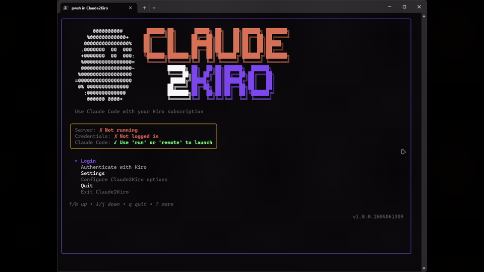
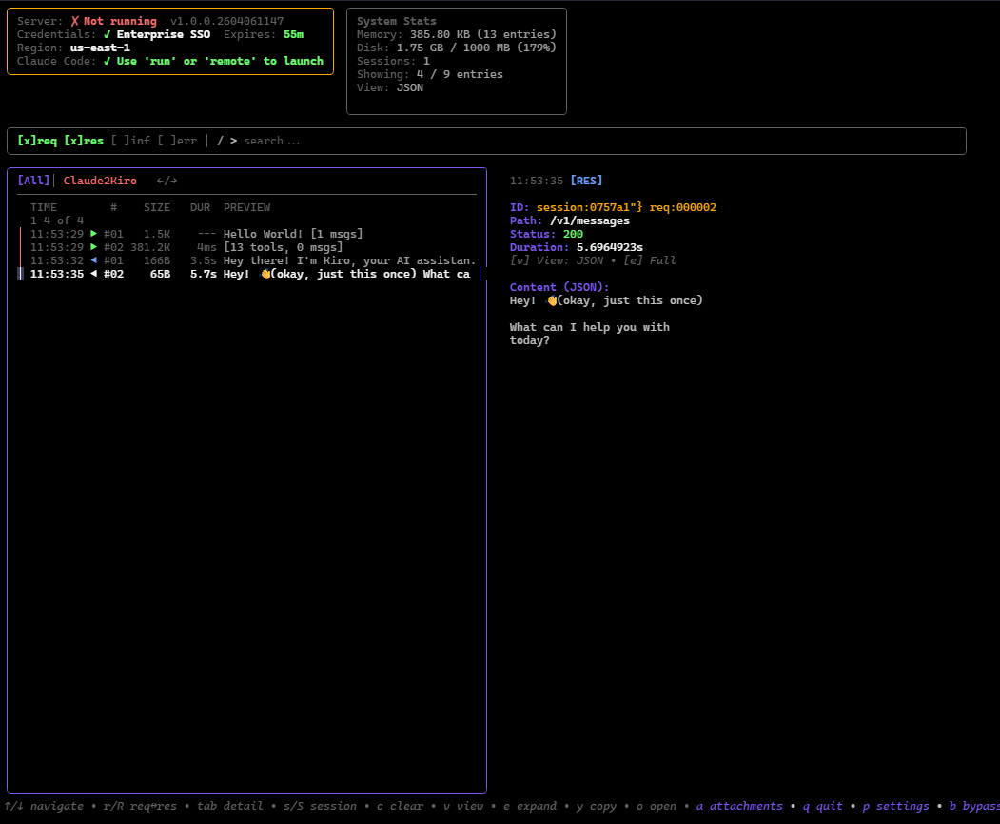
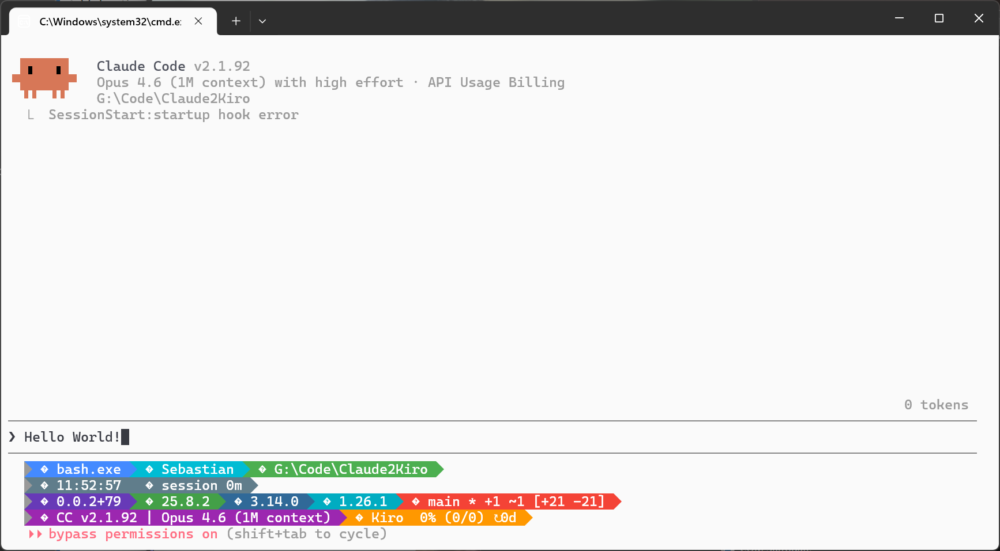

<p align="center">
  
</p>

<h1 align="center">Claude2Kiro</h1>

<p align="center">
  Use Claude Code with your Kiro subscription.
</p>

<p align="center">
  
  
  
</p>

<p align="center">
  <a href="#features">Features</a> •
  <a href="#install">Install</a> •
  <a href="#usage">Usage</a> •
  <a href="#docs">Docs</a> •
  <a href="#license">License</a>
</p>

Claude2Kiro is a local proxy and launcher that lets Claude Code use Kiro authentication through an Anthropic-compatible interface.

## Features

- Use **Kiro authentication** instead of an Anthropic subscription
- Launch **Claude Code** through a local proxy with one command
- Inspect requests, responses, and sessions in the built-in **TUI dashboard**
- Install with a **PowerShell** or shell script and keep it updated with the launcher
- Run as a headless proxy for other Anthropic-compatible tools

<p align="center">
  
</p>

## Install

### Windows

```powershell
irm https://raw.githubusercontent.com/sgeraldes/claude2kiro/main/install.ps1 | iex
```

Installs `claude2kiro.exe` to `%USERPROFILE%\.local\bin` and adds that directory to your user `PATH` if needed.

### Linux / macOS

```bash
curl -fsSL https://raw.githubusercontent.com/sgeraldes/claude2kiro/main/install.sh | bash
```

### Releases

Download binaries from:

- <https://github.com/sgeraldes/claude2kiro/releases>

## Usage

### `claude2kiro`

```bash
claude2kiro
```

Starts the interactive TUI. This is the simplest way to use the app.

From there you can:
- log in to Kiro
- start the proxy
- open the dashboard
- change settings
- launch Claude Code

<p align="center">
  
</p>

The interactive TUI is where you can monitor sessions, inspect requests and responses, and manage the proxy without memorizing commands.

### `claude2kiro login`

```bash
claude2kiro login
```

Opens the browser-based login flow and saves your Kiro credentials locally.

Supported login methods:
- GitHub
- Google
- AWS Builder ID
- Enterprise Identity Center

Use this first if you have not authenticated yet, or if you need to switch accounts.

### `claude2kiro run`

```bash
claude2kiro run
```

The main command for day-to-day use.

It:
- starts the local proxy
- installs or refreshes the Claude Code plugin
- sets up the environment for Claude Code
- launches Claude Code using your Kiro-backed access

<p align="center">
  
</p>

When Claude Code is launched this way, you will see that the session is being powered by **Kiro via claude2kiro proxy** instead of direct Anthropic billing.

It also installs the local **kiro-proxy** plugin, which gives you slash commands inside Claude Code:
- `/kiro-proxy:status`
- `/kiro-proxy:credits`
- `/kiro-proxy:logs`
- `/kiro-proxy:models`
- `/kiro-proxy:config`

### `claude2kiro update`

```bash
claude2kiro update
```

Downloads the latest release and switches the launcher to the new version.

Use this when you want to upgrade without reinstalling manually.

## Common commands

| Command | Purpose |
|---|---|
| `claude2kiro` | Open the interactive TUI for login, dashboard, settings, and launch actions |
| `claude2kiro login` | Authenticate with Kiro and save credentials locally |
| `claude2kiro run` | Start the proxy and launch Claude Code through Kiro |
| `claude2kiro update` | Download and switch to the latest released version |
| `claude2kiro logout` | Remove saved credentials |
| `claude2kiro server [port]` | Run only the headless proxy for advanced/manual setups |

## Docs

- [Installation](docs/INSTALLATION.md)
- [Usage](docs/USAGE.md)
- [Winget](docs/WINGET.md)
- [Protocol translation](docs/PROTOCOL_TRANSLATION.md)
- [Anthropic SSE format](docs/ANTHROPIC_SSE_FORMAT.md)
- [CodeWhisperer binary format](docs/CODEWHISPERER_BINARY_FORMAT.md)

## Adoption

Claude2Kiro is useful if you:

- already pay for **Kiro** and want to use **Claude Code** with it
- want a local **Anthropic-compatible endpoint** for tools that speak the Messages API
- want a simpler install and update path than building from source

## License

MIT
